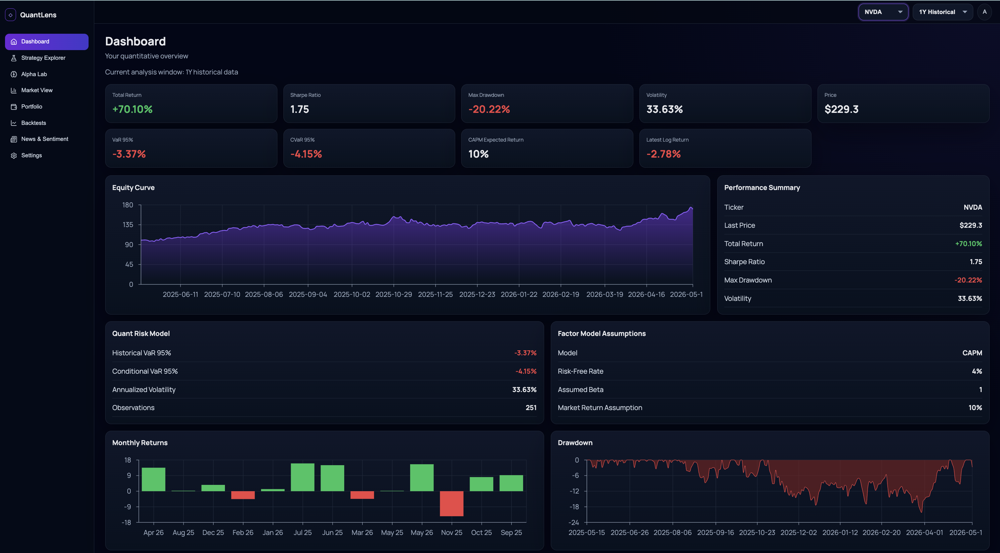
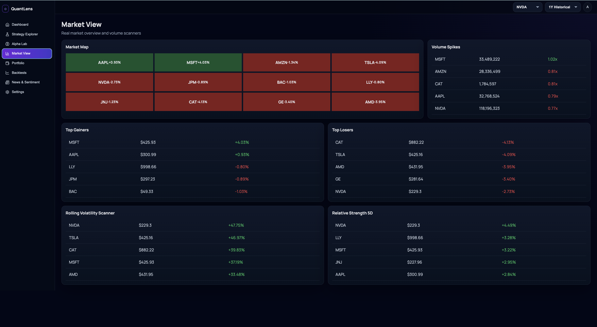
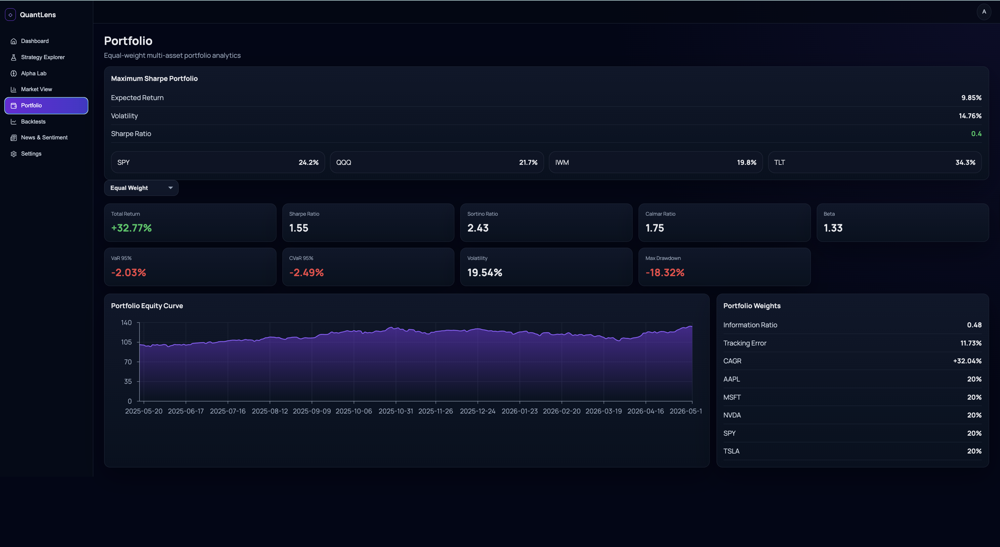
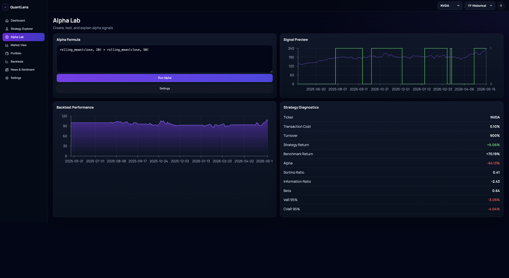

# QuantLens

QuantLens is a quantitative finance analytics platform built with Python, FastAPI, React, and Vite for exploring market data, analyzing portfolio risk, testing trading strategies, and visualizing quantitative metrics through a modern interactive dashboard.

## Workspace Overview


## Product Gallery

| Dashboard                            | Strategy Explorer                                      |
| ------------------------------------ | ------------------------------------------------------ |
|  |  |

| Market View                              | Portfolio                            |
| ---------------------------------------- | ------------------------------------ |
|  |  |

| Alpha Lab                           |
| ----------------------------------- |
|  |

# Features

- Quantitative market analytics
- Portfolio performance visualization
- Risk management metrics
- Strategy backtesting
- Alpha signal exploration
- Portfolio optimization
- CAPM factor model analytics
- Historical Value at Risk (VaR)
- Conditional Value at Risk (CVaR)
- Maximum drawdown analysis
- Python FastAPI backend
- React + Vite frontend
- Interactive dashboard UI

---

# Quant Finance Concepts

## Returns

Simple return:

```math
R_t = \frac{P_t}{P_{t-1}} - 1
```

Logarithmic return:

```math
r_t = \ln\left(\frac{P_t}{P_{t-1}}\right)
```

---

## Volatility

Annualized volatility:

```math
\sigma_{annual} = \sigma_{daily}\sqrt{252}
```

---

## Maximum Drawdown

Measures the largest peak-to-trough portfolio decline:

```math
MDD = \min\left(\frac{P_t}{\max(P_0,\dots,P_t)} - 1\right)
```

---

## Value at Risk (VaR)

Historical Value at Risk estimates the loss threshold at a selected confidence interval.

```math
VaR_\alpha = Quantile_\alpha(R)
```

Example:

- 95% VaR = -2.5%
- Only 5% of trading days are expected to lose more than 2.5%

---

## Conditional Value at Risk (CVaR)

Expected loss beyond the VaR threshold:

```math
CVaR_\alpha = E[R \mid R \le VaR_\alpha]
```

---

## Capital Asset Pricing Model (CAPM)

Expected return according to systematic market risk:

```math
E(R_i) = R_f + \beta_i(E(R_m)-R_f)
```

Where:

- \(R_f\) = risk-free rate
- \(\beta_i\) = asset beta
- \(E(R_m)\) = expected market return

---

# Project Architecture

```text
QuantLens
├── backend
│   └── app
│       ├── api
│       │   └── routes.py
│       │
│       ├── quant_engine
│       │   ├── analytics.py
│       │   ├── backtester.py
│       │   ├── factor_models.py
│       │   ├── metrics.py
│       │   ├── portfolio_optimization.py
│       │   ├── risk_models.py
│       │   └── strategy_engine.py
│       │
│       └── main.py
│
└── frontend
    └── src
        ├── components
        ├── pages
        ├── services
        ├── styles.css
        └── App.jsx
```

---

# Backend

The backend is built using FastAPI and serves quantitative analytics through REST APIs.

## Quantitative Engine Modules

### Risk Models

- Annualized volatility
- Historical VaR
- Conditional VaR
- Maximum drawdown
- Beta calculations

### Factor Models

- CAPM expected return
- Jensen’s alpha
- Rolling beta estimation

### Portfolio Optimization

- Equal-weight portfolios
- Inverse volatility weighting
- Portfolio volatility estimation

### Strategy Engine

- Momentum strategies
- Mean reversion strategies
- Moving average crossover signals
- Volatility-aware strategies

---

# Frontend

The frontend is built using:

- React
- Vite
- Modern responsive dashboard UI
- Interactive chart visualizations
- Real-time API-driven analytics

## Dashboard Features

- Equity curve visualization
- Drawdown monitoring
- Risk analytics cards
- Strategy explorer
- Market overview
- Portfolio analytics
- Research profile page

---

# API Endpoints

## Market Data

```text
GET /api/market/{ticker}
```

## Quant Analytics

```text
GET /api/analytics/{ticker}
```

## Portfolio Optimization

```text
GET /api/portfolio/optimize
```

## Strategy Signals

```text
GET /api/strategy/{strategy_name}
```

---

# Installation

## Clone Repository

```bash
git clone https://github.com/shiinalight/QuantLens.git
cd QuantLens
```

---

# Backend Setup

```bash
cd backend

python -m venv venv

source venv/bin/activate
```

Install dependencies:

```bash
pip install -r requirements.txt
```

Run backend:

```bash
uvicorn app.main:app --reload
```

Backend runs on:

```text
http://127.0.0.1:8000
```

---

# Frontend Setup

```bash
cd frontend
npm install
```

Create:

```text
frontend/.env.local
```

Add:

```env
VITE_API_BASE_URL=http://127.0.0.1:8000
```

Run frontend:

```bash
npm run dev
```

Frontend runs on:

```text
http://localhost:5173
```

---

# Deployment

## Frontend

Recommended deployment:

- Vercel

## Backend

Recommended deployment:

- Railway
- Render
- Fly.io

---

# Future Improvements

- Monte Carlo simulations
- Black-Scholes option pricing
- Fama-French factor models
- Machine learning alpha models
- Reinforcement learning trading agents
- Multi-asset portfolio optimization
- Live market data streaming
- User authentication
- Persistent portfolio storage

---

# Tech Stack

## Backend

- Python
- FastAPI
- Pandas
- NumPy

## Frontend

- React
- Vite
- JavaScript
- CSS

---

# License

MIT License

---

# Author

Built by Nooshin Pourkamali.

QuantLens is designed as a research-focused quantitative finance platform combining financial mathematics, portfolio analytics, and modern full-stack engineering.
